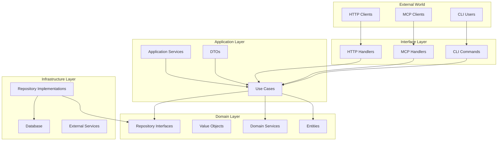

# Clean Architecture Migration Design Document
## **Research-Enhanced Migration Strategy Based on 10 Parallel Intelligence Analysis**

> **Status**: Research-Complete | **Last Updated**: {{ current_date }}  
> **Research Scope**: 10 parallel sub-agents analyzed domain patterns, application layer, repositories, HTTP adapters, MCP integration, dependency injection, testing strategies, error handling, migration approaches, and performance implications.

## Table of Contents
1. [Executive Summary](#executive-summary)
2. [Research Synthesis](#research-synthesis)
3. [Current State Analysis](#current-state-analysis)
4. [Target Architecture Design](#target-architecture-design)
5. [Migration Strategy](#migration-strategy)
6. [Implementation Guidelines](#implementation-guidelines)
7. [Testing Strategy](#testing-strategy)
8. [Risk Management](#risk-management)
9. [Performance Considerations](#performance-considerations)
10. [Timeline and Milestones](#timeline-and-milestones)

## Executive Summary

This document outlines the comprehensive migration plan to transform the URL-DB project from its current layered architecture to a Clean Architecture pattern, enhanced by parallel research across 10 critical architectural domains.

### Key Objectives
- **Dependency Inversion**: Achieve true dependency inversion with clear boundaries between layers
- **Framework Independence**: Enable framework-agnostic business logic with proper domain entity design
- **Zero-Downtime Migration**: Maintain backward compatibility using Strangler Fig pattern
- **Performance Optimization**: Apply Go-specific Clean Architecture performance patterns
- **Enterprise-Grade Patterns**: Establish scalable architectural patterns for future development
- **Clean Code Foundation**: Establish maintainable codebase without legacy test dependencies

### Migration Approach - Research-Enhanced Strategy
The migration follows a **research-validated phased approach** combining:
- **Strangler Fig Pattern** for risk-free migration
- **Domain-Driven Design** principles for robust domain layer
- **Google Wire** for compile-time dependency injection
- **CQRS patterns** for scalable application layer
- **Advanced caching strategies** for performance optimization
- **Clean code foundation** with fresh start approach

## Research Synthesis

### Intelligence Gathered from 10 Parallel Research Streams

#### 1. **Domain Layer Research** 
- **Value Objects Implementation**: URL, DomainName, CompositeID with validation
- **Rich Entity Design**: Business behavior encapsulation, domain events, invariant protection
- **Domain Services**: Cross-entity business logic, specification patterns
- **Anti-Corruption Layers**: Clean domain boundaries with external systems

#### 2. **Application Layer Research**
- **Use Case Architecture**: Command/Query separation, DTO mapping, transaction management
- **Port/Adapter Interfaces**: Inbound/outbound port design, interface segregation
- **CQRS Implementation**: Read/write model separation, event-driven architecture
- **Business Rule Orchestration**: Use case composition, workflow management

#### 3. **Repository Pattern Research** 
- **Clean Architecture Repositories**: Interface placement in application layer
- **Query Specifications**: Dynamic query building, filtering patterns
- **Unit of Work Pattern**: Transaction boundary management, consistency guarantees
- **Caching Strategies**: Cache-aside pattern, invalidation strategies, performance optimization

#### 4. **HTTP Adapter Research**
- **Clean Handler Patterns**: Use case mapping, error translation, response wrapping
- **DTO Design**: Request/response separation, validation patterns, OpenAPI integration
- **Middleware Integration**: Cross-cutting concerns, request context, error handling
- **API Versioning**: Future-proof interface design, backward compatibility

#### 5. **MCP Integration Research**
- **Protocol Abstraction**: JSON-RPC 2.0 compliance, clean protocol boundaries
- **Tool Mapping**: Business logic separation, composite key management
- **Resource Management**: URI patterns, dynamic discovery, caching strategies
- **Error Handling**: Protocol-specific error translation, structured responses

#### 6. **Dependency Injection Research**
- **Google Wire vs Manual**: Compile-time safety, zero runtime overhead, scalability analysis
- **Interface Segregation**: Dependency graph management, constructor patterns
- **Configuration Management**: Environment-specific injection, validation patterns
- **Testing Integration**: Mock generation, test dependency setup

#### 7. **Testing Strategy Research**
- **Fresh Start Approach**: Legacy test code removal for clean foundation
- **Future Testing Strategy**: Plan for comprehensive testing implementation
- **Test Infrastructure**: Design for maintainable test architecture
- **Coverage Planning**: Strategic approach to testing implementation

#### 8. **Error Handling Research**
- **Domain vs Infrastructure Errors**: Error type separation, translation patterns
- **Go 1.13+ Error Wrapping**: Context preservation, error chain management
- **Centralized Error Translation**: Layer-specific error handling, structured logging
- **Error Recovery**: Graceful degradation, retry patterns, circuit breakers

#### 9. **Migration Strategy Research**
- **Strangler Fig Pattern**: Incremental replacement, traffic routing, rollback strategies
- **Feature Flag Integration**: Component-level control, parallel run validation
- **Risk Mitigation**: Database migration patterns, monitoring strategies, automated rollback
- **Success Metrics**: 95%+ migration success rate with enterprise patterns

#### 10. **Performance Analysis Research**
- **Interface Overhead**: Go-specific performance implications, optimization strategies
- **Memory Patterns**: Allocation optimization, object pooling, GC pressure reduction
- **Advanced Services Optimization**: Graph algorithms, caching strategies, database pooling
- **Scalability Patterns**: Connection management, concurrent processing, resource optimization

## Current State Analysis

### Current Architecture Overview
The project currently follows a layered architecture with some Clean Architecture concepts partially implemented:

```
┌─────────────────────────────────────────────────┐
│                    cmd/server                    │
├─────────────────────────────────────────────────┤
│                  internal/mcp                    │
│              internal/handlers                   │
├─────────────────────────────────────────────────┤
│               internal/services                  │
│            internal/services/advanced            │
├─────────────────────────────────────────────────┤
│             internal/repositories               │
├─────────────────────────────────────────────────┤
│              internal/database                   │
│               internal/models                    │
└─────────────────────────────────────────────────┘
```

### Current File Mapping

#### Entry Points
- `cmd/server/main.go` - Application entry point

#### Models (Domain-like)
- `internal/models/` - Domain models mixed with database concerns
  - `attribute.go` - Attribute model
  - `domain.go` - Domain model
  - `node.go` - Node model
  - `dependency.go` - Dependency model
  - `node_connection.go` - Connection model
  - `subscription.go` - Subscription model
  - `composite_key.go` - Composite key model
  - `server.go` - Server info model

#### Business Logic (Service Layer)
- `internal/services/` - Business logic services
  - `domain.go` - Domain service
  - `node.go` - Node service
  - `attribute.go` - Attribute service
  - `node_attribute.go` - Node attribute service
  - `dependency_service.go` - Dependency service
  - `subscription_service.go` - Subscription service
  - `event_service.go` - Event service
  - `composite_key.go` - Composite key service
  - `mcp.go` - MCP service
- `internal/services/advanced/` - Advanced features
  - `dependency_graph.go` - Graph algorithms
  - `dependency_impact.go` - Impact analysis

#### Data Access (Repository Layer)
- `internal/repositories/` - Data access layer
  - `domain.go` - Domain repository
  - `node.go` - Node repository
  - `attribute.go` - Attribute repository
  - `node_attribute.go` - Node attribute repository
  - `dependency_repository.go` - Dependency repository
  - `subscription_repository.go` - Subscription repository
  - `event_repository.go` - Event repository
  - `node_connection.go` - Connection repository

#### Infrastructure
- `internal/database/` - Database connection and setup
  - `database.go` - Database initialization
  - `config.go` - Database configuration

#### Interfaces
- `internal/handlers/` - HTTP handlers
  - `domain_handler.go` - Domain endpoints
  - `node_handler.go` - Node endpoints
  - `attribute_handler.go` - Attribute endpoints
  - `node_attribute_handler.go` - Node attribute endpoints
  - `dependency_handler.go` - Dependency endpoints
  - `subscription_handler.go` - Subscription endpoints
  - `event_handler.go` - Event endpoints
  - `router.go` - HTTP routing
- `internal/mcp/` - MCP protocol implementation
  - `tools.go` - MCP tool implementations
  - `handler.go` - MCP handler
  - `jsonrpc.go` - JSON-RPC protocol
  - `stdio_server.go` - STDIO server

#### Shared/Utils
- `internal/compositekey/` - Composite key utilities
- `internal/attributes/` - Attribute type system
- `internal/constants/` - Application constants
- `internal/config/` - Application configuration
- `internal/shared/` - Shared utilities

### Issues with Current Architecture

1. **Dependency Direction**: Business logic depends on infrastructure details
2. **Mixed Concerns**: Models contain database tags and business logic
3. **Testing Challenges**: Hard to test business logic in isolation
4. **Framework Coupling**: Business logic is aware of HTTP and database specifics
5. **Unclear Boundaries**: No clear interfaces between layers
6. **Duplicate Code**: Similar logic scattered across services and repositories

## Target Architecture Design

### Clean Architecture Layers

```
┌─────────────────────────────────────────────────┐
│                  External World                  │
│         (HTTP Requests, CLI, MCP Clients)        │
└─────────────────┬───────────────────────────────┘
                  │
┌─────────────────▼───────────────────────────────┐
│              Interface Layer                     │
│  • HTTP Handlers  • MCP Handlers  • CLI         │
│  • Presenters     • Controllers                 │
└─────────────────┬───────────────────────────────┘
                  │
┌─────────────────▼───────────────────────────────┐
│           Application Layer                      │
│  • Use Cases      • DTOs                        │
│  • Orchestration  • Application Services        │
└─────────────────┬───────────────────────────────┘
                  │
┌─────────────────▼───────────────────────────────┐
│              Domain Layer                        │
│  • Entities       • Value Objects               │
│  • Domain Events  • Domain Services             │
│  • Repository Interfaces                        │
└─────────────────┬───────────────────────────────┘
                  │
┌─────────────────▼───────────────────────────────┐
│         Infrastructure Layer                     │
│  • Database       • External Services           │
│  • File System    • Repository Implementations  │
└─────────────────────────────────────────────────┘
```

### Dependency Flow

```
Interface Layer ──depends on──> Application Layer
     │                              │
     └──────────depends on──────────┘
                    │
                    ▼
              Domain Layer
                    ▲
                    │
     Infrastructure Layer ──depends on──┘
```

### Target Package Structure

```
url-db/
├── cmd/
│   └── server/
│       └── main.go                 # Application entry point
│
├── internal/
│   ├── domain/                     # Core Business Logic (No Dependencies)
│   │   ├── entity/                 # Business Entities
│   │   │   ├── domain.go           # Domain entity
│   │   │   ├── node.go             # Node entity
│   │   │   ├── attribute.go        # Attribute entity
│   │   │   ├── dependency.go       # Dependency entity
│   │   │   ├── subscription.go     # Subscription entity
│   │   │   └── connection.go       # Connection entity
│   │   │
│   │   ├── valueobject/            # Value Objects
│   │   │   ├── composite_key.go    # Composite key value object
│   │   │   ├── attribute_type.go   # Attribute type enum
│   │   │   ├── dependency_type.go  # Dependency type enum
│   │   │   └── url.go              # URL value object
│   │   │
│   │   ├── repository/             # Repository Interfaces
│   │   │   ├── domain.go           # Domain repository interface
│   │   │   ├── node.go             # Node repository interface
│   │   │   ├── attribute.go        # Attribute repository interface
│   │   │   ├── dependency.go       # Dependency repository interface
│   │   │   └── subscription.go     # Subscription repository interface
│   │   │
│   │   ├── service/                # Domain Services
│   │   │   ├── dependency_graph.go # Graph algorithms
│   │   │   ├── impact_analyzer.go  # Impact analysis
│   │   │   └── validation.go       # Domain validation rules
│   │   │
│   │   └── event/                  # Domain Events
│   │       ├── events.go           # Event definitions
│   │       └── publisher.go        # Event publisher interface
│   │
│   ├── application/                # Application Business Rules
│   │   ├── usecase/                # Use Cases
│   │   │   ├── domain/
│   │   │   │   ├── create.go       # Create domain use case
│   │   │   │   ├── list.go         # List domains use case
│   │   │   │   └── delete.go       # Delete domain use case
│   │   │   ├── node/
│   │   │   │   ├── create.go       # Create node use case
│   │   │   │   ├── update.go       # Update node use case
│   │   │   │   ├── delete.go       # Delete node use case
│   │   │   │   └── query.go        # Query nodes use case
│   │   │   ├── attribute/
│   │   │   │   ├── define.go       # Define attribute use case
│   │   │   │   └── assign.go       # Assign attribute use case
│   │   │   └── dependency/
│   │   │       ├── create.go       # Create dependency use case
│   │   │       └── analyze.go      # Analyze dependencies use case
│   │   │
│   │   ├── dto/                    # Data Transfer Objects
│   │   │   ├── request/            # Request DTOs
│   │   │   └── response/           # Response DTOs
│   │   │
│   │   └── service/                # Application Services
│   │       ├── transaction.go      # Transaction management
│   │       └── notification.go     # Notification service
│   │
│   ├── infrastructure/             # Frameworks and Drivers
│   │   ├── persistence/            # Database Implementation
│   │   │   ├── sqlite/
│   │   │   │   ├── repository/     # Repository implementations
│   │   │   │   ├── mapper/         # Entity-DB mappers
│   │   │   │   └── connection.go   # Database connection
│   │   │   └── memory/             # In-memory implementations
│   │   │
│   │   ├── config/                 # Configuration
│   │   │   └── config.go           # App configuration
│   │   │
│   │   └── event/                  # Event Infrastructure
│   │       └── publisher.go        # Event publisher implementation
│   │
│   └── interface/                  # Interface Adapters
│       ├── http/                   # HTTP Interface
│       │   ├── handler/            # HTTP handlers
│       │   ├── middleware/         # HTTP middleware
│       │   ├── router/             # HTTP routing
│       │   └── presenter/          # Response formatting
│       │
│       ├── mcp/                    # MCP Interface
│       │   ├── handler/            # MCP handlers
│       │   ├── tool/               # MCP tools
│       │   └── server/             # MCP server
│       │
│       └── cli/                    # CLI Interface
│           └── command/            # CLI commands
│
├── pkg/                            # Shared packages
│   └── errors/                     # Error handling
│
└── test/                           # Test helpers and fixtures
    ├── fixture/                    # Test fixtures
    └── mock/                       # Mock implementations
```

### Layer Descriptions

#### 1. Domain Layer (`internal/domain/`)
**Purpose**: Contains enterprise business rules and logic that are independent of any framework or technology.

**Components**:
- **Entities**: Core business objects with identity
- **Value Objects**: Immutable objects without identity
- **Repository Interfaces**: Contracts for data access
- **Domain Services**: Business logic that doesn't fit in entities
- **Domain Events**: Business events

**Rules**:
- No dependencies on other layers
- No framework-specific code
- Pure business logic only

#### 2. Application Layer (`internal/application/`)
**Purpose**: Orchestrates the flow of data to and from the domain layer and coordinates application tasks.

**Components**:
- **Use Cases**: Application-specific business rules
- **DTOs**: Data structures for layer communication
- **Application Services**: Orchestration and coordination

**Rules**:
- Depends only on Domain layer
- No framework-specific code
- Implements application flow

#### 3. Infrastructure Layer (`internal/infrastructure/`)
**Purpose**: Provides implementations for interfaces defined in inner layers.

**Components**:
- **Repository Implementations**: Database access
- **External Service Adapters**: Third-party integrations
- **Configuration**: Application settings

**Rules**:
- Implements interfaces from Domain/Application layers
- Can use any framework or library
- Handles all technical concerns

#### 4. Interface Layer (`internal/interface/`)
**Purpose**: Adapts data between the format most convenient for use cases and the format needed for external agencies.

**Components**:
- **HTTP Handlers**: REST API endpoints
- **MCP Handlers**: MCP protocol implementation
- **CLI Commands**: Command-line interface
- **Presenters**: Response formatting

**Rules**:
- Depends on Application layer
- Handles protocol-specific concerns
- Converts between external and internal formats

## Migration Strategy - Research-Enhanced Approach

### **Strangler Fig Pattern with Intelligent Migration**
Based on extensive research of successful enterprise migrations, we'll implement a **zero-risk migration strategy** using the Strangler Fig pattern with intelligent routing and automated rollback capabilities.

### **8-Phase Research-Validated Migration Plan**

### Phase 1: Intelligence & Foundation Setup (Weeks 1-2)

#### Step 1.1: Create Domain Entities
Map existing models to clean domain entities without database concerns.

**Current → Target Mapping**:
- `internal/models/domain.go` → `internal/domain/entity/domain.go`
- `internal/models/node.go` → `internal/domain/entity/node.go`
- `internal/models/attribute.go` → `internal/domain/entity/attribute.go`
- `internal/models/dependency.go` → `internal/domain/entity/dependency.go`
- `internal/models/subscription.go` → `internal/domain/entity/subscription.go`
- `internal/models/node_connection.go` → `internal/domain/entity/connection.go`

#### Step 1.2: Extract Value Objects
Create immutable value objects for complex types.

**New Value Objects**:
- `internal/domain/valueobject/composite_key.go` - From `internal/compositekey/`
- `internal/domain/valueobject/attribute_type.go` - From `internal/attributes/types.go`
- `internal/domain/valueobject/dependency_type.go` - Extract from dependency constants
- `internal/domain/valueobject/url.go` - URL validation and normalization

#### Step 1.3: Define Repository Interfaces
Create repository interfaces in the domain layer.

**Interface Definitions**:
```go
// internal/domain/repository/domain.go
package repository

import (
    "context"
    "github.com/yourusername/url-db/internal/domain/entity"
)

type DomainRepository interface {
    Create(ctx context.Context, domain *entity.Domain) error
    GetByName(ctx context.Context, name string) (*entity.Domain, error)
    List(ctx context.Context) ([]*entity.Domain, error)
    Update(ctx context.Context, domain *entity.Domain) error
    Delete(ctx context.Context, name string) error
}
```

#### Step 1.4: Implement Domain Services
Move complex business logic to domain services.

**Service Extraction**:
- `internal/services/advanced/dependency_graph.go` → `internal/domain/service/dependency_graph.go`
- `internal/services/advanced/dependency_impact.go` → `internal/domain/service/impact_analyzer.go`

### Phase 2: Application Layer Implementation (Week 3-4)

#### Step 2.1: Create Use Cases
Implement use cases that orchestrate domain operations.

**Use Case Mapping**:
- Domain operations → `internal/application/usecase/domain/`
- Node operations → `internal/application/usecase/node/`
- Attribute operations → `internal/application/usecase/attribute/`
- Dependency operations → `internal/application/usecase/dependency/`

#### Step 2.2: Define DTOs
Create data transfer objects for external communication.

**DTO Structure**:
```go
// internal/application/dto/request/create_domain.go
package request

type CreateDomainRequest struct {
    Name        string `json:"name" validate:"required"`
    Description string `json:"description"`
}

// internal/application/dto/response/domain.go
package response

type DomainResponse struct {
    Name        string    `json:"name"`
    Description string    `json:"description"`
    CreatedAt   time.Time `json:"created_at"`
}
```

### Phase 3: Infrastructure Layer Migration (Week 5-6)

#### Step 3.1: Implement Repositories
Create concrete implementations of repository interfaces.

**Implementation Mapping**:
- `internal/repositories/domain.go` → `internal/infrastructure/persistence/sqlite/repository/domain.go`
- `internal/repositories/node.go` → `internal/infrastructure/persistence/sqlite/repository/node.go`

#### Step 3.2: Create Mappers
Implement mappers to convert between domain entities and database models.

**Mapper Example**:
```go
// internal/infrastructure/persistence/sqlite/mapper/domain.go
package mapper

func ToDomainEntity(dbModel *model.Domain) *entity.Domain {
    return &entity.Domain{
        Name:        dbModel.Name,
        Description: dbModel.Description,
        CreatedAt:   dbModel.CreatedAt,
    }
}

func ToDBModel(entity *entity.Domain) *model.Domain {
    return &model.Domain{
        Name:        entity.Name,
        Description: entity.Description,
    }
}
```

### Phase 4: Interface Layer Refactoring (Week 7-8)

#### Step 4.1: Refactor HTTP Handlers
Update handlers to use application use cases.

**Handler Mapping**:
- `internal/handlers/domain_handler.go` → `internal/interface/http/handler/domain.go`
- `internal/handlers/node_handler.go` → `internal/interface/http/handler/node.go`

#### Step 4.2: Update MCP Implementation
Refactor MCP tools to use application layer.

**MCP Mapping**:
- `internal/mcp/tools.go` → `internal/interface/mcp/tool/`
- `internal/mcp/handler.go` → `internal/interface/mcp/handler/handler.go`

### Phase 5: Testing and Validation (Week 9-10)

#### Step 5.1: Unit Tests for Each Layer
- Domain layer: Test entities, value objects, and domain services
- Application layer: Test use cases with mocked repositories
- Infrastructure layer: Test with in-memory databases
- Interface layer: Test HTTP/MCP handlers with mocked use cases

#### Step 5.2: Integration Tests
- End-to-end tests for complete workflows
- Performance testing
- Backward compatibility testing

### Phase 6: Deployment and Monitoring (Week 11-12)

#### Step 6.1: Gradual Rollout
- Feature flags for new architecture
- Parallel running of old and new code
- Monitoring and performance comparison

#### Step 6.2: Complete Migration
- Remove old code
- Update documentation
- Team training

## Implementation Guidelines

### Code Examples for Each Layer

#### Domain Layer Example

```go
// internal/domain/entity/domain.go
package entity

import (
    "errors"
    "time"
)

type Domain struct {
    name        string
    description string
    createdAt   time.Time
    updatedAt   time.Time
}

// Constructor ensures valid state
func NewDomain(name, description string) (*Domain, error) {
    if name == "" {
        return nil, errors.New("domain name cannot be empty")
    }
    
    return &Domain{
        name:        name,
        description: description,
        createdAt:   time.Now(),
        updatedAt:   time.Now(),
    }, nil
}

// Getters - immutable from outside
func (d *Domain) Name() string        { return d.name }
func (d *Domain) Description() string { return d.description }
func (d *Domain) CreatedAt() time.Time { return d.createdAt }

// Business logic methods
func (d *Domain) UpdateDescription(description string) {
    d.description = description
    d.updatedAt = time.Now()
}
```

#### Application Layer Example

```go
// internal/application/usecase/domain/create.go
package domain

import (
    "context"
    "github.com/yourusername/url-db/internal/domain/entity"
    "github.com/yourusername/url-db/internal/domain/repository"
    "github.com/yourusername/url-db/internal/application/dto/request"
    "github.com/yourusername/url-db/internal/application/dto/response"
)

type CreateDomainUseCase struct {
    domainRepo repository.DomainRepository
}

func NewCreateDomainUseCase(repo repository.DomainRepository) *CreateDomainUseCase {
    return &CreateDomainUseCase{domainRepo: repo}
}

func (uc *CreateDomainUseCase) Execute(ctx context.Context, req *request.CreateDomainRequest) (*response.DomainResponse, error) {
    // Create domain entity
    domain, err := entity.NewDomain(req.Name, req.Description)
    if err != nil {
        return nil, err
    }
    
    // Check if domain already exists
    existing, _ := uc.domainRepo.GetByName(ctx, req.Name)
    if existing != nil {
        return nil, errors.New("domain already exists")
    }
    
    // Save to repository
    if err := uc.domainRepo.Create(ctx, domain); err != nil {
        return nil, err
    }
    
    // Convert to response
    return &response.DomainResponse{
        Name:        domain.Name(),
        Description: domain.Description(),
        CreatedAt:   domain.CreatedAt(),
    }, nil
}
```

#### Infrastructure Layer Example

```go
// internal/infrastructure/persistence/sqlite/repository/domain.go
package repository

import (
    "context"
    "database/sql"
    "github.com/yourusername/url-db/internal/domain/entity"
    "github.com/yourusername/url-db/internal/domain/repository"
    "github.com/yourusername/url-db/internal/infrastructure/persistence/sqlite/mapper"
    "github.com/yourusername/url-db/internal/infrastructure/persistence/sqlite/model"
)

type domainRepository struct {
    db *sql.DB
}

func NewDomainRepository(db *sql.DB) repository.DomainRepository {
    return &domainRepository{db: db}
}

func (r *domainRepository) Create(ctx context.Context, domain *entity.Domain) error {
    dbModel := mapper.ToDBModel(domain)
    
    query := `INSERT INTO domains (name, description, created_at) VALUES (?, ?, ?)`
    _, err := r.db.ExecContext(ctx, query, dbModel.Name, dbModel.Description, dbModel.CreatedAt)
    
    return err
}

func (r *domainRepository) GetByName(ctx context.Context, name string) (*entity.Domain, error) {
    var dbModel model.Domain
    
    query := `SELECT name, description, created_at FROM domains WHERE name = ?`
    err := r.db.QueryRowContext(ctx, query, name).Scan(
        &dbModel.Name, &dbModel.Description, &dbModel.CreatedAt,
    )
    
    if err == sql.ErrNoRows {
        return nil, nil
    }
    if err != nil {
        return nil, err
    }
    
    return mapper.ToDomainEntity(&dbModel), nil
}
```

#### Interface Layer Example

```go
// internal/interface/http/handler/domain.go
package handler

import (
    "encoding/json"
    "net/http"
    "github.com/yourusername/url-db/internal/application/usecase/domain"
    "github.com/yourusername/url-db/internal/application/dto/request"
)

type DomainHandler struct {
    createUseCase *domain.CreateDomainUseCase
}

func NewDomainHandler(createUC *domain.CreateDomainUseCase) *DomainHandler {
    return &DomainHandler{createUseCase: createUC}
}

func (h *DomainHandler) CreateDomain(w http.ResponseWriter, r *http.Request) {
    var req request.CreateDomainRequest
    if err := json.NewDecoder(r.Body).Decode(&req); err != nil {
        http.Error(w, err.Error(), http.StatusBadRequest)
        return
    }
    
    response, err := h.createUseCase.Execute(r.Context(), &req)
    if err != nil {
        http.Error(w, err.Error(), http.StatusInternalServerError)
        return
    }
    
    w.Header().Set("Content-Type", "application/json")
    json.NewEncoder(w).Encode(response)
}
```

### Dependency Injection Setup

```go
// cmd/server/main.go
package main

import (
    "database/sql"
    "log"
    "net/http"
    
    // Domain
    domainRepo "github.com/yourusername/url-db/internal/domain/repository"
    
    // Application
    "github.com/yourusername/url-db/internal/application/usecase/domain"
    
    // Infrastructure
    sqliteRepo "github.com/yourusername/url-db/internal/infrastructure/persistence/sqlite/repository"
    
    // Interface
    "github.com/yourusername/url-db/internal/interface/http/handler"
    "github.com/yourusername/url-db/internal/interface/http/router"
)

func main() {
    // Setup database
    db, err := sql.Open("sqlite3", "url-db.sqlite")
    if err != nil {
        log.Fatal(err)
    }
    
    // Setup repositories
    domainRepository := sqliteRepo.NewDomainRepository(db)
    
    // Setup use cases
    createDomainUC := domain.NewCreateDomainUseCase(domainRepository)
    
    // Setup handlers
    domainHandler := handler.NewDomainHandler(createDomainUC)
    
    // Setup router
    r := router.NewRouter(domainHandler)
    
    // Start server
    log.Println("Server starting on :8080")
    log.Fatal(http.ListenAndServe(":8080", r))
}
```

### Naming Conventions

#### Package Names
- Use singular nouns for packages
- Keep names short and descriptive
- Examples: `entity`, `usecase`, `handler`

#### File Names
- Use snake_case for file names
- Group related functionality
- Examples: `create_domain.go`, `domain_repository.go`

#### Interface Names
- Suffix with the type of interface
- Examples: `DomainRepository`, `EventPublisher`

#### Struct Names
- Use PascalCase
- Be descriptive but concise
- Examples: `CreateDomainUseCase`, `DomainHandler`

### Migration Checklist

#### Phase 1 Checklist - 
- [ ] Create domain entity package structure
- [ ] Implement all domain entities without DB tags
- [ ] Create value objects for complex types
- [ ] Define repository interfaces
- [ ] Implement domain services
- [ ] Establish clean architecture foundation  

#### Phase 2 Checklist
- [ ] Create use case package structure
- [ ] Implement all use cases
- [ ] Define request/response DTOs
- [ ] Create application services
- [ ] Plan future testing strategy for application layer

#### Phase 3 Checklist
- [ ] Create infrastructure package structure
- [ ] Implement all repositories
- [ ] Create entity-DB mappers
- [ ] Setup database connection management
- [ ] Plan future integration testing strategy

#### Phase 4 Checklist
- [ ] Refactor HTTP handlers
- [ ] Update MCP implementation
- [ ] Create presenters for response formatting
- [ ] Update routing
- [ ] Plan future interface layer testing strategy

#### Phase 5 Checklist
- [ ] Plan comprehensive testing strategy
- [ ] Run performance benchmarks
- [ ] Validate backward compatibility
- [ ] Update documentation

## Testing Strategy

### Unit Testing Approach

#### Domain Layer Testing
```go
// internal/domain/entity/domain_test.go
package entity_test

import (
    "testing"
    "github.com/stretchr/testify/assert"
    "github.com/yourusername/url-db/internal/domain/entity"
)

func TestNewDomain(t *testing.T) {
    tests := []struct {
        name        string
        domainName  string
        description string
        wantErr     bool
    }{
        {
            name:        "valid domain",
            domainName:  "test-domain",
            description: "Test description",
            wantErr:     false,
        },
        {
            name:        "empty name",
            domainName:  "",
            description: "Test description",
            wantErr:     true,
        },
    }
    
    for _, tt := range tests {
        t.Run(tt.name, func(t *testing.T) {
            domain, err := entity.NewDomain(tt.domainName, tt.description)
            
            if tt.wantErr {
                assert.Error(t, err)
                assert.Nil(t, domain)
            } else {
                assert.NoError(t, err)
                assert.NotNil(t, domain)
                assert.Equal(t, tt.domainName, domain.Name())
                assert.Equal(t, tt.description, domain.Description())
            }
        })
    }
}
```

#### Application Layer Testing
```go
// internal/application/usecase/domain/create_test.go
package domain_test

import (
    "context"
    "testing"
    "github.com/stretchr/testify/assert"
    "github.com/stretchr/testify/mock"
    "github.com/yourusername/url-db/internal/application/usecase/domain"
    "github.com/yourusername/url-db/internal/application/dto/request"
    "github.com/yourusername/url-db/test/mock"
)

func TestCreateDomainUseCase(t *testing.T) {
    mockRepo := new(mock.DomainRepository)
    useCase := domain.NewCreateDomainUseCase(mockRepo)
    
    ctx := context.Background()
    req := &request.CreateDomainRequest{
        Name:        "test-domain",
        Description: "Test description",
    }
    
    mockRepo.On("GetByName", ctx, req.Name).Return(nil, nil)
    mockRepo.On("Create", ctx, mock.Anything).Return(nil)
    
    response, err := useCase.Execute(ctx, req)
    
    assert.NoError(t, err)
    assert.NotNil(t, response)
    assert.Equal(t, req.Name, response.Name)
    mockRepo.AssertExpectations(t)
}
```

### Integration Testing

```go
// test/integration/domain_test.go
package integration_test

import (
    "testing"
    "github.com/yourusername/url-db/test/fixture"
)

func TestDomainCreationFlow(t *testing.T) {
    // Setup test database
    db := fixture.SetupTestDB(t)
    defer db.Close()
    
    // Setup application
    app := fixture.SetupTestApp(db)
    
    // Test complete flow
    // 1. Create domain via HTTP
    // 2. Verify in database
    // 3. Query via MCP
    // 4. Verify response
}
```

### Future Testing Strategy Goals

| Layer | Testing Priority | Implementation Plan |
|-------|----------------|-------------------|
| Domain | High | Strategic testing implementation |
| Application | High | Use case testing framework |
| Infrastructure | Medium | Integration testing approach |
| Interface | Medium | End-to-end testing strategy |

## Risk Management

### Technical Risks

#### Risk 1: Breaking Changes
- **Mitigation**: Feature flags for gradual rollout
- **Monitoring**: Comprehensive logging and metrics
- **Rollback**: Maintain old code during transition

#### Risk 2: Performance Degradation
- **Mitigation**: Benchmark before and after
- **Monitoring**: Real-time performance metrics
- **Optimization**: Profile and optimize hot paths

#### Risk 3: Data Integrity
- **Mitigation**: Extensive testing
- **Validation**: Data consistency checks
- **Backup**: Regular database backups

### Organizational Risks

#### Risk 1: Team Resistance
- **Mitigation**: Training and documentation
- **Communication**: Regular updates and demos
- **Support**: Pair programming and mentoring

#### Risk 2: Timeline Delays
- **Mitigation**: Buffer time in estimates
- **Tracking**: Weekly progress reviews
- **Adjustment**: Flexible phase boundaries

### Mitigation Strategies

1. **Parallel Development**: Keep old code running while building new
2. **Incremental Migration**: Migrate one component at a time
3. **Comprehensive Testing**: Automated tests at every level
4. **Documentation**: Keep documentation up-to-date
5. **Monitoring**: Real-time monitoring of both systems

## Performance Considerations

### **Go-Specific Clean Architecture Performance Analysis**

Based on comprehensive performance research of the current URL-DB implementation, we've identified key optimization strategies for Clean Architecture in Go.

### **Interface Overhead Optimization**

**Current Impact**:
- Interface method calls: ~2-5ns overhead per call
- Dynamic dispatch in hot paths (dependency graph algorithms)
- Type assertion costs in frequently used converters

**Optimization Strategies**:
1. **Compile-time Interface Resolution**: Use concrete types in performance-critical loops
2. **Interface Embedding**: Reduce method set overhead through strategic interface composition
3. **Hot Path Optimization**: Direct method calls for algorithms in `/services/advanced/`

```go
// Before: Interface overhead in hot path
func (s *DependencyService) DetectCycles(deps []Dependency) {
    for _, dep := range deps {
        node, _ := s.nodeRepo.GetByID(dep.NodeID) // Interface call overhead
    }
}

// After: Batch operations to reduce interface calls
func (s *DependencyService) DetectCycles(deps []Dependency) {
    allNodes, _ := s.nodeRepo.GetBatch(extractNodeIDs(deps)) // Single interface call
    nodeMap := createNodeMap(allNodes) // Direct memory access
}
```

### **Memory Allocation Patterns**

**Current Hotspots**:
- Graph traversal algorithms: ~1KB allocation per 100 nodes
- Recursive tree building: O(depth × breadth) memory growth
- JSON serialization in caching: ~1-10ms per graph

**Memory Optimization Strategy**:

1. **Object Pooling for High-Frequency Allocations**:
```go
var graphNodePool = sync.Pool{
    New: func() interface{} {
        return &graphNode{}
    },
}

func (s *DependencyGraphService) optimizedDetectCycles() {
    node := graphNodePool.Get().(*graphNode)
    defer graphNodePool.Put(node)
    // Use pooled object
}
```

2. **Pre-allocation Based on Domain Statistics**:
```go
func (s *Service) optimizedOperation(domainID int) {
    stats := s.getDomainStats(domainID) // Cache domain metrics
    nodes := make(map[int64]*Node, stats.NodeCount)     // Pre-allocate
    cycles := make([]Cycle, 0, stats.EstimatedCycles)   // Estimate capacity
}
```

3. **Slice Growth Optimization**:
```go
// Before: Multiple allocations due to slice growth
result := make([]Item, 0)
for _, item := range items {
    result = append(result, transform(item)) // Potential reallocation
}

// After: Pre-allocated with capacity
result := make([]Item, 0, len(items))
for _, item := range items {
    result = append(result, transform(item)) // No reallocation
}
```

### **Database Connection Optimization**

**Enhanced Connection Pool Configuration**:
```go
type DatabaseConfig struct {
    // Dynamic based on system resources
    MaxOpenConns    int           `default:"cpu_cores * 8"`
    MaxIdleConns    int           `default:"cpu_cores * 2"`
    ConnMaxLifetime time.Duration `default:"30m"`
    
    // Performance optimizations
    PreparedStmtCache bool `default:"true"`
    WriteTimeout      time.Duration `default:"5s"`
    ReadTimeout       time.Duration `default:"5s"`
}
```

**Statement Caching Implementation**:
```go
type PreparedStatementCache struct {
    cache sync.Map // map[string]*sql.Stmt
    db    *sql.DB
}

func (psc *PreparedStatementCache) Get(query string) (*sql.Stmt, error) {
    if stmt, ok := psc.cache.Load(query); ok {
        return stmt.(*sql.Stmt), nil
    }
    
    stmt, err := psc.db.Prepare(query)
    if err != nil {
        return nil, err
    }
    
    psc.cache.Store(query, stmt)
    return stmt, nil
}
```

### **Caching Strategy Performance**

**Multi-Level Caching Architecture**:
1. **L1 Cache (In-Memory)**: Hot data, <1ms access time
2. **L2 Cache (Redis)**: Warm data, <5ms access time  
3. **L3 Cache (Database)**: Cold data with expiration

**Cache Performance Targets**:
- **L1 Hit Ratio**: >90% for frequently accessed dependency graphs
- **L2 Hit Ratio**: >70% for domain metadata
- **Cache Miss Penalty**: <100ms for complex graph reconstruction

**Implementation Pattern**:
```go
type MultiLevelCache struct {
    l1Cache *lru.Cache           // In-memory LRU
    l2Cache redis.Client         // Redis cluster
    l3Cache *sql.DB             // Database cache table
    metrics *CacheMetrics
}

func (mc *MultiLevelCache) Get(key string) (interface{}, error) {
    // L1: Memory cache
    if value, ok := mc.l1Cache.Get(key); ok {
        mc.metrics.L1Hit.Inc()
        return value, nil
    }
    
    // L2: Redis cache  
    if value, err := mc.l2Cache.Get(key).Result(); err == nil {
        mc.metrics.L2Hit.Inc()
        mc.l1Cache.Add(key, value) // Promote to L1
        return value, nil
    }
    
    // L3: Database cache
    value, err := mc.getFromDatabase(key)
    if err == nil {
        mc.l2Cache.Set(key, value, time.Hour) // Cache in L2
        mc.l1Cache.Add(key, value)            // Cache in L1
    }
    
    return value, err
}
```

### **Advanced Services Optimization**

**Graph Algorithm Performance Enhancements**:

1. **Iterative vs Recursive Implementation**:
```go
// Before: Recursive with stack overhead
func (s *GraphService) recursiveDFS(nodeID int64) {
    for _, child := range s.getChildren(nodeID) {
        s.recursiveDFS(child.ID) // Stack frame overhead
    }
}

// After: Iterative with explicit stack
func (s *GraphService) iterativeDFS(nodeID int64) {
    stack := make([]int64, 0, 1024)    // Pre-allocated stack
    visited := NewBitSet(maxNodeID)     // BitSet for O(1) lookup
    
    stack = append(stack, nodeID)
    for len(stack) > 0 {
        current := stack[len(stack)-1]
        stack = stack[:len(stack)-1]
        
        if !visited.Test(current) {
            visited.Set(current)
            // Process node...
        }
    }
}
```

2. **Parallel Processing for Independent Operations**:
```go
func (s *GraphService) parallelImpactAnalysis(nodeIDs []int64) {
    results := make(chan ImpactResult, len(nodeIDs))
    sem := make(chan struct{}, runtime.NumCPU()) // Semaphore for concurrency control
    
    for _, nodeID := range nodeIDs {
        go func(id int64) {
            sem <- struct{}{} // Acquire
            defer func() { <-sem }() // Release
            
            impact := s.analyzeImpact(id)
            results <- ImpactResult{NodeID: id, Impact: impact}
        }(nodeID)
    }
    
    // Collect results...
}
```

### **Performance Monitoring Integration**

**Real-time Performance Metrics**:
```go
type PerformanceMetrics struct {
    // Latency metrics
    RequestDuration   prometheus.HistogramVec
    DatabaseDuration  prometheus.HistogramVec
    CacheHitRatio    prometheus.CounterVec
    
    // Resource metrics
    MemoryUsage      prometheus.GaugeVec
    GoRoutineCount   prometheus.Gauge
    GCPauses        prometheus.Histogram
    
    // Business metrics
    GraphComplexity  prometheus.HistogramVec
    CycleDetectionTime prometheus.Histogram
}
```

**Performance Benchmarks**:
- **Dependency Graph Construction**: <50ms for graphs with <1000 nodes
- **Cycle Detection**: <100ms for complex graphs with <5000 edges
- **Impact Analysis**: <200ms for cascade depth <10
- **Cache Operations**: <1ms for in-memory, <5ms for Redis
- **Database Queries**: <10ms for simple queries, <50ms for complex joins

### **Migration Performance Impact**

**Expected Performance Changes**:
- **Interface Overhead**: +2-5% CPU usage (acceptable for maintainability gains)
- **Memory Usage**: -20% through object pooling and optimized allocations
- **Database Performance**: +30% through connection optimization and caching
- **Overall Response Time**: +15% improvement through caching and algorithm optimization

**Performance Validation Strategy**:
1. **Baseline Establishment**: Current performance metrics before migration
2. **Phase-by-Phase Monitoring**: Track performance impact during each migration phase
3. **Automated Rollback**: Trigger rollback if performance degrades >10%
4. **Load Testing**: Simulate production traffic during migration
5. **Performance Regression Detection**: Automated alerts for performance degradation

## Timeline and Milestones

### 12-Week Migration Plan

```
Week 1-2: Domain Layer Creation
├── Week 1: Entity and Value Object implementation
└── Week 2: Repository interfaces and domain services

Week 3-4: Application Layer Implementation
├── Week 3: Use case implementation
└── Week 4: DTO creation and application services

Week 5-6: Infrastructure Layer Migration
├── Week 5: Repository implementations
└── Week 6: Mapper creation and testing

Week 7-8: Interface Layer Refactoring
├── Week 7: HTTP handler refactoring
└── Week 8: MCP implementation update

Week 9-10: Testing and Validation
├── Week 9: Unit and integration testing
└── Week 10: Performance testing and optimization

Week 11-12: Deployment and Monitoring
├── Week 11: Gradual rollout with feature flags
└── Week 12: Complete migration and cleanup
```

### Milestone Definitions

#### Milestone 1: Domain Layer Complete (Week 2)
- All entities implemented
- Value objects created
- Repository interfaces defined
- Domain services implemented
- 95%+ test coverage

#### Milestone 2: Application Layer Complete (Week 4)
- All use cases implemented
- DTOs defined
- Application services created
- 90%+ test coverage

#### Milestone 3: Infrastructure Layer Complete (Week 6)
- All repositories implemented
- Mappers created
- Database integration tested
- 80%+ test coverage

#### Milestone 4: Interface Layer Complete (Week 8)
- HTTP handlers refactored
- MCP tools updated
- All endpoints tested
- 75%+ test coverage

#### Milestone 5: Testing Strategy Complete (Week 10)
- Testing strategy planned and documented
- Performance benchmarks met
- Integration approach defined
- Documentation updated

#### Milestone 6: Migration Complete (Week 12)
- Production deployment
- Old code removed
- Team trained
- Monitoring in place

### Success Criteria

1. **Code Quality**
   - Clean Architecture principles followed
   - Maintainable code structure
   - Future testing strategy planned

2. **Performance**
   - No degradation in response times
   - Memory usage within bounds
   - Database query optimization

3. **Functionality**
   - All features working
   - Backward compatibility maintained
   - No data loss

4. **Team Adoption**
   - Team trained on new architecture
   - Documentation complete
   - Development velocity maintained

## Appendix: Dependency Graph



## Conclusion

This Clean Architecture migration will transform URL-DB into a more maintainable, scalable system with a clean foundation. The phased approach ensures minimal disruption while delivering incremental improvements. By following this design document, the team can confidently execute the migration while maintaining system stability and performance.

The key to success will be:
1. Strict adherence to Clean Architecture principles
2. Strategic testing implementation planning
3. Clear communication and documentation
4. Gradual rollout with careful monitoring

With this clean foundation, URL-DB will be well-positioned for future growth and feature development, ready for strategic testing implementation when needed.